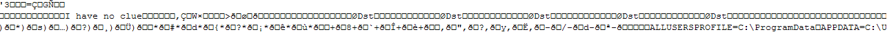

No-one likes non-payment
=====


Surprising, there are a few things you can achieve with code that is never run.

## when it *looks* like all cases result in an action
###   Avoiding having to test that complex code path ...
```C++

void sneaky(int condition, string& output) {
	switch (condition) {

	case 1:
		output = "1";
		break;
	...
	defaut: output = "my_complex_result";

	}
}

```
   
###   Ensuring the "other" default value is returned ...
```C++

void other_default(int condition, string& output) {
	output = "";
	switch (condition) {

	case 1:
		output = "1";
		break;
	...
	defaut: output = "default";

	}

}

```
   
## Preventing that -wall -werror build from being created
   "no return from non-void function"
```C++
string you_shall_not_pass(int condition) {
	switch (condition) {

	case 1:
		return "1";
	...
	defaut:
		return "run you fools";

	}

}

```


## Or even a super simple way to dump the environment
  when you just can't look up the documentation
```C++
string quickdump(int condition) {
	switch (condition) {

	case 1:
		return "1";
	...
	defaut:
		return "surprise!";

	}

}

```

the output is:



So, now you know which OS type I ran this on, and have what looks like a decent chunk of that application's environment variables.
All without looking up the APIs!


