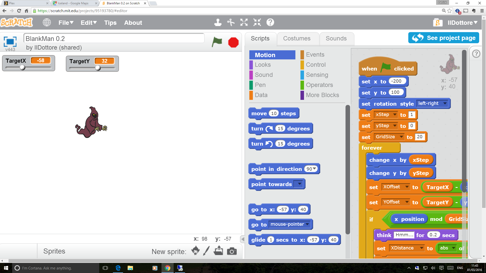
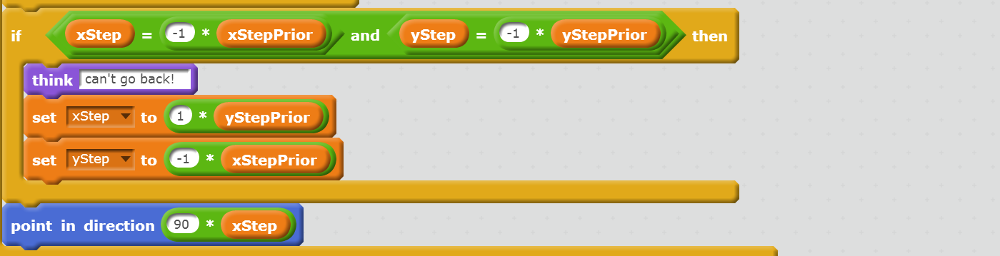
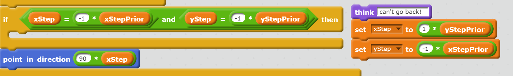

The Tao of Scratch
====

Abstract
---

When I look at Scratch, I see something ‘different’.

I’d like persuade you to my viewpoint by going through what I see are the Good Points.

I’ll be up-front here and state my target audience is the ‘noble corporate toiler’.
It has hopefully been a while since you were introduced / subjected
to a computer based teaching tool. Scratch is a tool for implementing
computing projects, based upon many years of thought, and it is well worth
taking a look.

# Just What is Scratch?

The best place to start is the Scratch web site, where there is a description
of the project [Scratch-1] and the main portal [Scratch-2]. The Wikipedia
page is also good [Wikipedia-1].

It’s a visual programming language, consisting of composable code
blocks that form the elements of a program. It is available as a web
application online, and implements a visual stage as the program output.

There is also an offline version now, which largely matches the basic
capabilities of the web version, omitting online-only features.

# A Whistle Stop tour
 
Scratch operates on a visual stage of 480 x 360 virtual pixels, and can be
viewed at varying dpi – `Good Point 1: fixed stage extent`. The stage is a
sprite [Wikipedia-2] and can be given script code, and any number of
sprites can be placed on the stage to compose a visual scene. The sprites
have a scripts container, which owns aggregations of code blocks that can
interact with stage changes, key and mouse events and manipulate the
sprites’ properties. The sprites have a concept of their direction and can
be made to orient in any direction, move and ‘bounce’ within the stage
area automatically. Finally, the large array of primitive code blocks
available for the scripts can react to events and messages and with the
sprites, and allow the programmer to construct a range of different
behaviours and visual experiences.

Figure 1 is a grab of a minimal project put together from an empty project
and the built in resources.
 
 
 
## Visualisation 
The entire (basic) environment is visual, with editors for all aspects of the
sprites and code blocks. The stage is manipulated at both ‘run time’ and
‘design time’ in the same way, which is `Good Point 2: persistence of
stage state`. This allows fine positioning by eye, avoiding too many
demands on mental arithmetic for the initial learning stages.

## Resources

Image and audio resources are embedded into to the project and are
available in a standard library – `Good Point 3: built in resources` – which
can be expanded by assets uploaded to the project. All of these can be
copied, and modified once embedded.

## Running the project

There is a Green button to start running, and a Red button to stop running.
What running means can be deceptively simple – the simplest event is
‘when flag clicked’, which can have some code blocks attached
underneath – this could perform initialisation or start a processing loop of
some kind. You can have as many as you like.

## Debugging

Debugging is an interesting proposition for the target audience.
* Adults (example) @garybernhardt: “I’m in a super good mood.
Everything is still broken, but now it’s funny instead of making me
mad.”
* Years 3–8: Now, I’ve seen their projects, and for some let me assure
you: ‘Everything is broken’, but they’re not fazed.

There is a learning curve on the road to learning to debug your project, and
there are some useful built-ins, like message and comment notes. The
coolest of which, though, is: `Good Point 4: code blocks can be modified
at runtime in the designer`. All versions allow blocks to be dragged in, then
dragged out while the project is running.

Can _your_ tool do that?

Figure 2 is a grab of the code blocks being inspected while the code is
running and Figure 3 is a grab of a chunk of code blocks after being pulled
out of their container block _while the code is running_.

Did I mention you can do this _while the code is running_?

You can do this while just using the mouse – the selection extends
naturally from your selected block to the end of the enclosing container
block – making `Good Point 5: selection of blocks has some subtle but
powerful affordances`. Making use of `Good Point 6: the positioning of
code blocks in the scripts area can be arbitrary`, you can park a small
chunk of logic within the visual context of where it was running to reduce
the cognitive load.

This works particularly well on an interactive whiteboard to show the
effect of a chunk of code blocks.

Even more impressively: the Old Scratch 1.x desktop version, has a
similar single step, which illuminates the currently running block!

Clearly
this was too mind-blowing and is no longer available in the current
version.

# Why Should I be interested in Scratch?
A good question. Here are some topics to persuade you. 

## It's coming to a "classroom near you" 

`Good Point 7: ‘This Thing is Happening’` Note also that Scratch at this
moment is on the way to being taught in the UK in primary and secondary
schools – that’s years 3–8! (around 7 to 12 years old). [gov.uk]

## The Scratch Heritage 

The Scratch environment is inspired by the work of Seymour Papert
[Papert], epitomised in the book _Mindstorms_ [Papert93]. Listing the
whole corpus of the whole back story is out of scope, so this is going to
be left for the interested reader.

## Some Examples

You can explore for yourself by visiting the website [Scratch-2], making
use of `Good Point 8: it has a single entry search box`. Having found a
project of interest, you can dive straight in and take a look using `Good
Point 9: Scratch has a ‘See Inside’ button`. If you like what you find you
can then simply fork it using `Good Point 10: Scratch has a ‘Remix’ button`.

That new project is now available for you to modify, debug and run in any
way you see fit.

Now, although it ruins the nice 3-part list rhetorical flourish, let me just
mention here `Good Point 11: Scratch lets you edit before login and then
allows you to login and save if you wish`.

Question: how many _paid for_ services that we use for generating wealth
can say the same? For the classroom environment, when dealing with the
early years where it is a stretch to require detailed forward planning, this
is a Good Thing.

# What can be done in Scratch?
I won’t promote individual projects, and further I will assert that I don’t
need to. Instead let’s rely upon `Good Point 8: it has a single entry search
box` and I can list some jump off points:
* Yorkshire to English dictionary [Scratch-Dictionary]
* Innumerable RPG type things about cat clans [Scratch-Cats]
 * no, me neither
* Space Invaders [Scratch-Invaders]
 * aww, yeah...
* Pacman [Scratch-Pacman]

## Who are the users?

Well, it seems to be primarily educationalists and UK scholastic years 3–
8 (at least), we’ll see why in a bit, through `Good Point 12: a cast of
thousands` – there are 10s of millions of projects and millions of users.
[Scratch-Stats1] [Scratch-Stats2]

# A List of Additional Good Points

There’s a raft of features: `Good Points 13–21`:

Logo-like Sprite Primitives+, Code Blocks+,
Message Passing, Composable Mathematical
Operations+, Sprite Cloning, Entry Prompts, Text
Messages, Pen operations and Sound. The annotated items are 
all illustrated in Figure 2 in one way. The latter
are in my personal order of appreciation. A feature
worth mentioning is Message Passing, which
allows broadcasts of user defined messages to all
items on a stage.

## Supported Development Styles
So, the possibilities are limitless, but
there is a definite set of approaches that
practitioners will work through.
* Basic: sprites, backdrops, costumes
Coupled with setting some
properties, the bounce/direction/
touching colour capabilities allow
treating the visual stage as a mini
engine with some rudimentary support for using the stage as a
dressed ‘set’.
* Advanced: explicit positioning/drawing
To move onto to more dynamic generation of content, it is possible
to use explicit positioning, and the use of pens to craft arbitrary
shapes.

## Immediacy
This goes to the kind of benefits mentioned in the kind of thing Brett
Victor talks about [Victor] the good stuff in my opinion starts around 10:00.
A brief summary would be that he demonstrates a "Braid" - like [Braid] game in a live editor,
which has the ability to adjust variables using sliders at run time
and to record and overlay timelines of the program state.
The gist of the open question raised was "what could you do, if you could only visualise the outcomes?". 

I still think about the impression that talk had
on me. It’s not quite possible to reproduce that talk right now in Scratch,
but the immediacy of the run–change–run loop is still very forceful.

## Accessibility
Why haven’t I mentioned _entirely free to use_ yet? If you care about
diversity and granting access to self-improvement to all then this is huge.

## Sharing
From `Good Point 10: Scratch has a ‘Remix’ button`
* It exists and works – if you like something and want to have a try at
improving it, you just press the button
* Is this due to `Good Point 22: Scratch has No Merge Action` (for you
corporate warriors)
 * this point maybe bears some examination - there are no libraries in basic scratch and
 no code sharing. In order to add some code inspired by code from elsewhere,
 one has to understand what to splice in to a project, and actually do it.
* Because there are two ways to generate Scratch projects: remix and create new, 
there is at least some pseudo Darwininan process that improves the fitness of remixes,
while the "gene pool" gets a steady stream of new projects.

## Deployment 
From `Good Point 23: Scratch has a ‘public’ checkbox` almost nothing
could be simpler – you just click the ‘public’ checkbox.

## Politeness
From `Good Point 24: Scratch seems to be incredibly good natured`, is it
because they’re all under 12? (or over 30?) Well, there are The Rules
[Scratch-3] and there are the banned topics [Scratch-4]. There even seems
to be a Scratch version of Herobrine [Scratch-Herobrine].

## Don't worry: it's not like "coding"
It is important to point out that ‘just coding’ is not the point – it’s
engagement with the environment, using creative approaches and
problem solving that are the real end games here. This is highlighted here: [code.org]

## Suitability for classroom and distributed teaching
`Good Point 25: Scratch supports multiple sessions on the same account
and concurrent work on different projects`. This is one setup I can
advocate: given each project has a thumbnail in the account’s list of
projects: `Good Point 26: all projects have a thumbnail` it’s very easy for
a supervisor to see what individuals are up to. This also allows the
supervisor to investigate and debug a project remotely if needs be.

## Teachable Moments 1:  "Big chunks of blocks" vs. Message Passing
When did you, dear reader, love to learn message passing as a style? In
the Scratch environment, it seems to be a few months from a standing
start. Very quickly, the users seem to grasp that giant chunks of nested
blocks and variables can be replaced by sending the appropriate message
to be handled by a smaller chunk of code blocks.

## Teachable Moments 2: Space Invaders vs Pacman

This seems to be one of challenges that sorts the population. Caveat: this
is from my purely personal sampling. I have found the Space Invaders
clones tend to be very high quality, whereas for the ‘deceptively simple’
Pacman there tends to be a raft of issues that challenge the users `Good
Point 27: some tasks lend themselves to ‘teachable moments’`. My
suspicion is that there are a couple of required complex concepts in a maze
game that Scratch does not deliver in its default toolbox, or that are easily
synthesised. This might be a fruitful area to extend the sprite’s
capabilities:

Confession time: for the second time (approx 30+ years after the first
attempt) I am re-implementing Pacman and I’m finding that talking about
the incomplete (broken?) versions I created on the way can be used for
some ‘teachable moments’, for example:
* various ‘baby step’ projects that show the small adjustments to the
code blocks that will implement the stages of a ghost
* moving smoothly between points on a grid
* choosing between N, E, W, S to head towards Pacman/some other
target
* turning left instead of reversing direction on the next choice (which
delivers the distinctive Pacman ‘ghost patrolling in circles’
behaviour for free)

   
# User Straw Poll
It hit me that I should get an assessment from the horse’s mouth, as it
were. I therefore ran a very unscientific poll of a miniscule sample set of
users, and asked them one question.
The results for answers to “What’s the best thing about Scratch?” are:

| Thing  | Votes |
| ------------- | ------------- |
| You can draw costumes            | 1 |
| You can use your imagination     | 2 |
| You can make games               | 4 |
| It's simple                      | 1 |
| It's easy to share               | 1 |
| It's satisfying to finish things | 1 |

So, making games wins it, but the ability to express yourself is clearly
highly valued. It’s very encouraging that user agency afforded by working
in Scratch is prized over passive consumption.

# Can it really all be Lovely In The Garden?
Sounds too good to be true, right?
* Well, it _is_ a social environment with quite young users interacting
over the internet running arbitrary code. Security concerns will
always be with us, but there as mentioned are rules and admins
which (touch wood) seem to work.
* Is it so addictive as to prevent people progressing to (say) HTML
and python? This is a concern I have heard expressed: Scratch can
seem to easily become the tool of choice to prototype an idea, which
is dual edged: it’s a good thing to get an idea captured quickly, but
conversely it would be good to stretch oneself and branch out.
* There is a very serious number of games, some of which are quite
impressive and diverting...

# Conclusion and Lessons for "Grown ups"
So here we come to the punchline: I have joked that some companies
could figure out how to write and deploy their business apps using
Scratch. That’s not in fact a serious proposition, but I suggest we can see
that the secret of the success is all the Good Things, working to make the
environment as expressive as possible.

## Many operations take one step
A case in point is the debugging example already demonstrated; in fact the
users slip naturally into re-initialising or exploring different initial
conditions for the stage in a rough manner _by dragging the sprites back
into position while the project is running_. It’s only upon writing the
sentence that it has struck me how extraordinary that is. There is an
analogue with for example the mavens of languages supporting a
command line REPL for ‘real work’, and also raw web development. Yet
for many commercial systems, many steps exist between us and the prize.

## Most things are quick
This multiplies the time savings with the prior point, but more importantly
is key to a learning environment that encourages and rewards exploration.
This is why coding club ‘classes’ should ideally not need a squad of
instructors to oversee and guide work as the users can very well formulate
hypotheses and test them themselves in short order.

## The "Ah, of course" moments
Hopefully I have shied away from employing too much hyperbole (!) in
going over Scratch, and have instead relied upon the Good Points to make
my case. In re-reading I see a pattern emerging of key concepts that have
been selected and made available in a frictionless manner. This is part of
the power of the Scratch approach, as the cognitive load is minimized,
driving out distractions from the flow of working with the concepts of the
project. For me this is the key takeaway: a real commitment to reducing
the superfluous complexity of our tool sets leads to better outcomes.

Acknowledgments
---------

TODO(PMM) - ticket is out with HR - if needed, it can be ditched 
Bloomberg LP (http://www.bloomberg.net) very generously supports my volunteering of time to mentor at an after school club, under the auspices of Code Club (http://codeclub.org.uk) 

References
---

[Braid] https://en.wikipedia.org/wiki/Braid_(video_game) 

[Code Club] http://codeclub.org.uk

[code.org] http://worrydream.com/MeanwhileAtCodeOrg/

[gov.uk] https://www.gov.uk/government/news/harmful-ict-curriculumset-to-be-dropped-to-make-way-for-rigorous-computer-science

[Papert] http://www.papert.org/

[Papert93] Papert, Seymour (1993) Mindstorms http://www.goodreads.com/book/show/703532.Mindstorms

[Scratch-1] https://llk.media.mit.edu/projects/783/

[Scratch-2] http://scatch.mit.edu

[Scratch-3] http://wiki.scratch.mit.edu/wiki/Scratch_Rules

[Scratch-4] http://wiki.scratch.mit.edu/wiki/List_of_Controversial_Topics_on_Scratch

[Scratch-Cats] https://scratch.mit.edu/search/google_results/?q=cat+clans

[Scratch-Dictionary] https://scratch.mit.edu/search/google_results/?q=Yorkshire+Dictionary

[Scratch-Herobrine] http://minecraft.gamepedia.com/Herobrine

[Scratch-Invaders] https://scratch.mit.edu/search/google_results/?q=space+invaders

[Scratch-Pacman] https://scratch.mit.edu/search/google_results/?q=pacman

[Scratch-Stats1] http://wiki.scratch.mit.edu/wiki/Scratch_Statistics

[Scratch-Stats2] https://scratch.mit.edu/statistics

[Victor] http://worrydream.com/#!/InventingOnPrinciple

[Wikipedia-1] https://en.wikipedia.org/wiki/Scratch_(programming_language)

[Wikipedia-2] https://en.wikipedia.org/wiki/Sprite_(computer_graphics)

