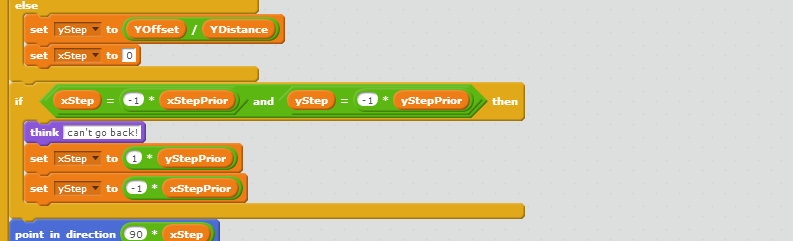
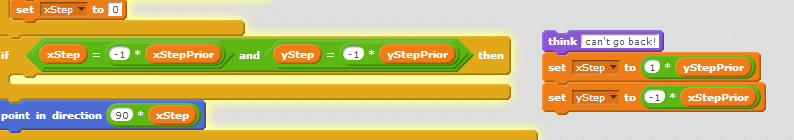

The Tao of Scratch
====

Abstract
====

When I look at Scratch, I see something different.

Let me try to persuade you of this by listing and explaining the magic of the `Good Points`.

# What is Scratch?

http://scatch.mit.edu

_TODO(PMM) something from the web site_

Note also that is now going into a "classroom near you" in the UK in primary to secondary - that's years 3-8! - see the announcement here: https://www.gov.uk/government/news/harmful-ict-curriculum-set-to-be-dropped-to-make-way-for-rigorous-computer-science

## Inspiration

_TODO(PMM)  précis of route from Mindstorms to Scratch

Seymour Papert http://www.papert.org/

Mindstorms book http://www.goodreads.com/book/show/703532.Mindstorms

## Examples

I am not going to reference any.

Instead, just go see for yourself by visiting http://scratch.mit.edu, making use of  `Good Point 1: it has a single entry search box`.
You can even dive straight in and take a look - in `Good Point 2: Scratch has a "See Inside" button`.
You can then just fork it using `Good Point 3: Scratch has a "Remix" button`
- that new project is now available for you to modify, debug and run in any way you see fit.

Although it ruins my since 3-part list rhetorical flourish, let me just mention
`Good Point 4 here: Scratch lets you edit before login *and then* allows you to login and save if you wish`.

How many _paid for_ services that we use for generating wealth can say the same?

For the classroom environment, when dealing with the years where it is a stretch to mandate detailed forward planning, this is a Good Thing.

### What can be done in Scratch?
I won't promote individual projects, but instead rely upon `Good Point 1: it has a single entry search box`

 * Yorkshire to English dictionary
  * https://scratch.mit.edu/search/google_results/?q=Yorkshire+Dictionary 
 * innumerable RPG type things about cat clans
  * https://scratch.mit.edu/search/google_results/?q=cat+clans
  * no, me neither
 * Space Invaders
  * aww, yeah...
  * https://scratch.mit.edu/search/google_results/?q=space+invaders
 * Pacman 
  *  https://scratch.mit.edu/search/google_results/?q=pacman

## Target Audience
I'll be up-front here and state my target audience is the "noble corporate toiler", it has perhaps been a while since you were introduced / subjected to a teaching tool (a memory from work that causes a shudder is the Computer Based Training that was less than tolerant of where irrelevant spaces were or were not in my answers).

### But the users are?

Educationalists and Year 3-8 (at least).

"Everything is broken and they don't particularly mind"

## Whistle Stop tour
 
 TODO(PMM) - grab of a project?
 
 * TOOD(PMM) Visualisation yes.
 * But scratch desktop has _single step_!

 * All versions allow blocks to be dragged in, then dragged out *while running*-
  * can _your_  tool do that?
  *  pictures of said?

### This is a grab the code blocks being inspected while the code is running

### This is a grab of a chunk of code blocks pulled out _while the code is running_

You can do this while just using the mouse - the selection extends naturally from your selected block to the end of the enclosing container block - another `Good point SSSS: selection of blocks has some subtle but powerful affordances`

## More Good Points

`Good Points 5-14:`

Logo like Sprite Primitives, Code Blocks, Message passing, composable mathematical operations, cloning, entry prompts, text messages, pen operations, sound

These are in my personal order of significance TODO(PMM) cherry pick some to illustrate

TODO(PMM) Sprites with bounce / direction / touching colour VS explicitly positioned/drawn objects

* Immediacy
This goes to the kind of benefits mentioned in the kind of thing Brett Victor talks about

TODO(PMM) reference to the Bret Victor demos and the impact they have.

* Accessibility

## Why haven't I mentioned _entirely free to use_ yet?
* If you care about diversity and granting access to self improvement to all then this is huge.

## Sharing
From `Good Point 3: Scratch has a "Remix" button`
* It exists and works
* Is this because it of `Good Point 15: Scratch has No Merge Action` (for you corporate warriors)

## Deployment 
From `Good Point 16: Scratch has a "public" checkbox`
* ahahaha - you just press "Share"!

## Politeness
From `Good Point 17: Scratch seems to be incredibly good natured`
* Is it because they're all under 12? ( or perhaps over 30 ?)
 * what element of self selection of the group, and self policing is going on here?
 * is this in fact a _very interesting outcome_ we might want to think about more closely

* It's a constrained environment
 * `Good Point MMM: there are  "Only a few ways to do certain things"`
* Except when it's not
 * `Good Point NNN: counterpoint to MMM  'Since when did that stop anyone"`

## Suitability for classroom and distributed teaching
  `Good Point PPPP: Scratch supports multiple sessions on the same account and concurrent work`
  Given each project has a thumbnail: `Good Point QQQQ: all projects have a thumbnail` it's very easy for a supervisor to see what they're up to: even in the corners.

# TODO(PMM) Big chunks of blocks vs. messages
When did you, dear reader, love to learn messages passing as a style?
In the Scratch environment, it seems to be a few months from a standing start.

# TODO(PMM) Space Invaders vs Pacman
This seems to be one of challenges that sorts the population - the Space Invaders clones tend to be very high quality, whereas for the "deceptively simple Pacman" there tends to be a raft of issues that challenge `Good Point RRRR: some tasks lend themselves to "teachable moments"`

* Scratch has some "Magic" features which are well loved 
 * `Good Point OOO: Vector -> bitmap -> Vector!`
 * "Other magic" TOOD(PMM)
  * concurrency - what sequence are operations run in?

# Technology
* It's a flask app ( I didn't know )
 * (And I still don't care)
 * And nor do they!

# Lessons for "Grown ups"
 TODO(PMM) - think about some "contrast and compares" here.

# TODO(PMM) Is there a dark scratch?

# Can it really all be lovely in the garden?
* Security concerns will always be with us
* Is it addictive enough to prevent people progressing?
 * - to HTML (? barf)
 * to python
 * confession time: for the second time (approx 30+ years after the first attempt) I am re-implementing Pacman
  * and I'm finding that talking about the incomplete (broken?) versions I "Saved As" on the way can be used for  `Good Point RRRR: some tasks lend themselves to "teachable moments"`
  * for example, I have various baby step projects that will show the stages of
   * move smoothly betweens points on a grid
   * choose from N, E, W, S to head to Pacman
   * now turn left instead of reversing on the next choice -> delivers the ghost patrolling in circles behaviour for free

Footnotes
---------

TODO(PMM) - check the wording here carefully
Bloomberg LP (http://www.bloomberg.net) very generously supports my volunteering of time to mentor at an after school club, under the auspices of Code Club (http://codeclub.org.uk) 

### References

* Seymour Papert MindStorms TODO(PMM)

* Gratuitous Bret victor link re: Seymour Papert
http://worrydream.com/MeanwhileAtCodeOrg/

* Gratuitous Bret victor link #2
http://worrydream.com/#!/InventingOnPrinciple

