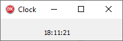

`I come here not to bury Delphi, but to praise it.`
====

But first what is Delphi?
---------------

>It is a riddle, wrapped in a mystery, inside an enigma

### And why write about it?

It's not a controversial statement that Delphi is not what it once was in its heydey.
Nevertheless, I think it's worth reviewing what might have formed part of the secret sauce that was part of its success back then.
The current version now supports building 64-bit projects across the 3 main desktop platforms, to select one area of evolution of the product.  
Furthermore the original aspects that were key for me are not only still there, but better than before.

### Non goals and Own Goals

There are many things I will not be discussing in this article. 
For example, there is always _Much To Discuss_ when it comes to choice of programming language -  I am told - but I will be attempting to steer clear of controversy of that nature.  
Comparing laundry lists of features between languages in some kind of checklist knockout tournament is certainly not the aim here.  
Instead, I want to recall - or if you will eulogise - a rich seam of features of the tool that for me made Delphi the game changer that it was then...  
Back when I used it full time these techniques were what made it so productive and what's more fun to work with, and I humbly submit that there are few tools that come close to touching it even now.

First, A Quick Review
----------------

Delphi is a commercial product for developing software - [embarcadero2019-1], [wikipedia2019-1], with a proprietary IDE and version of Object Pascal [wikipedia2019-2] that integrates tightly with the solution [embarcaderodocs2019-1] . There is even a free version you can download from [embarcadero2019-2], and if you can puzzle your way past the registration djinns, you can have it installed and up and running in a few minutes.

A heavily abridged table of releases with release for some key milestones

 Year | Release | Supports development for | Notable Enhancement
|--- |--- |---  |---  
| 1993 | Delphi 1.0 | Win16 | From out of nowhere, handling a GPF TODO(PMM) what is a GPF?
| 1996 | Borland Delphi 2 | Win32 | first win32 compiler
| 1998 | Inprise Delphi 4 | Win32 | last version allowing 16-bit development
| 2003 | Borland Delphi 8 | Win32 | .NET
| 2005 | Borland Delphi 2005 | Win32 |
| 2011 | Embarcadero Delphi XE2 | Win32, Win64 | first version producing 64-bit binaries
| 2012 | Embarcadero Delphi XE3 | Win32, Win64 | last version with .NET support
| 2018 | Embarcadero Delphi 10.3 Rio | Win32, Win64 | current day

For prior art: there is even an ACCU article [accu1998] article, and if you want a much funnier, arguably less slightly less technical summary of the early days - try this on for size [stob2002].

Here's five bullet points I've chosen to give a flavour of the system:

### Fast

Compile times were always in the vanguard, currently there are quotes of many thousands of lines per second.  
The time from a standing start of just source to a fully linked native executable that was ready to go was also very very short. In the days of "spinning rust" drives, this is a feature that really mattered - there is a nice little review here [prog2009].

### Strongly Typed (mainly*)

For loops could only be Ordinal types. I got over the shock of not being able to increment a `double` type very quickly and never looked back.  
You could (and should) declare enums and sub-range types. It would then be a compilation _and runtime_ error to assign incorrect values to these types, if you chose to enable the strict compilation mode, which you almost always should.

```delphi
type
// everyone likes cards
  Suit = (Club, Diamond, Heart, Spade);
// small things that it's just embarassing to get wrong
  SmallNumber = -128..127;
  SomeCaps = 'A'..'Z';
  Month = 0..11;
```

### Run Time Type information at all times

One could always identify the type of an object at runtime and it was built into the language - with a little more effort one could browse all the types in the programs' type system. This will come in useful for building up complex objects, as we will see.

### Straightforward dependency management
  
The language has files called `units` - basically modules, which supported `interface` and `implementation` sections for exported symbols and internal only code.  
Circular dependencies were a _compile time error_, it's worth taking a second to let that sink in .  
This required the developer to structure their program as a Directed Acyclic Graph strongly encouraged a way of organising one's code in such a way that one only had to really inspect the implementation section of a unit, and then choose whether to make it a dependency in the interface or not. Rinse and repeat for the rest of the program. In addition, the order of initialisation and finalisation of the units was straightforward and robust (_even if spelled incorrectly_) - see later ;) ).

### Extensible RTL and Visual class libraries exploiting the strengths of the language

Object Pascal supports class properties (read/write, write-only, read-only) as a first class feature.
Objects on the stack are simply not allowed - I suspect eliminating this capability freed Delphi from having to deal with a large class of issues related to runtime use of code.
Coupled with the ability to use the RTTI, these work together to support configurability of classes from properties.

* although, there were some funky compiler features that allowed for late-bound function calls, mainly to support scripting OLE objects.

### Source based Component Model

It's worth bearing in mind that the time when Delphi was conceived was the era of the rise of the Component based software model. For example - people could pay (remember paying for software?) a nugatory amount for a component that would emulate Excel and embed it into their software.

https://en.wikipedia.org/wiki/Component-based_software_engineering

In the very first release of Delphi was a thorough guide to writing components, proselytising for the style of authoring components. This was really high quality work and - true story - we kept a copy one of the Delphi 1 guide chapters that didn't survive to later releases around to consult, as it remained relevant. 

### You could go deep if you wanted

For those minded to do so, the features of a language for the "hard core programmer" were also there: 
* full access to the FFI of binaries of other languages at link time
* a range of calling conventions
* hand-crafted dynamic loading of code modules
* inline assembly

Contention: Delphi was inherently very dynamic for its time
---------------------------

This is my central thesis.

In 1999, I could fire up the IDE, load the source of a visual form connected to, say a database and see and navigate records fetched from the database *live in the designer*.
The development environment was quick and effective to work in, and I had access to the source for debugging and simply improving my mind by reading the code.  
That feature just on its own, helped to teach me a lot about the engineering of a coherent architecture.
And for those prepared to take the time to investigate, it had a cornucopia of treasures to uncover beyond the super user friendly surface.


### Example: how the ability to read and _debug into_ the source make a difference

Here's a simple UI app I created in a few clicks with no code. Setting one breakpoint and stepping in using one key combination I see where the application launches the main UI form and then enters the main Windows interactive message loop.


_Sidebar_ 
> - " remember the 90s were wild, man"

This was the time of the rise of the Component based model - people could pay (remember paying for software?) a nugatory amount for a component that would emulate, say some portion of the Excel spreadsheet editor and embed it into their software [wikipedia2019-3].  
In Delphi I could study the built-in in components, or follow the tutorials and write my own if needs be, or figure out how to achieve my aims using the existing functionality.


### Delphi's Streaming System and Form Design

Now the real killer app for the app development was the _fully synchronised visual designer_

Let's have a look at some actual code to plug together some hypothetical framework objects.
Note, this process relies upon the concepts of
* properties
* the Delphi closure type (reference to method call on object instance)
* and RTTI to allow the RTL to work all the magic of wiring up the properties
* there is also a hint of a framework which defines the ownership from the line 
   ```delphi
   TfrmClock.Create(Application);
   ```

```pascal
begin

  frmClock := TfrmClock.Create(Application);
  lblTime := TLabel.Create(frmClock)
  lblTime.Caption := '...'
  trmTick := TTimer.Create(frmClock);
  trmTick.onTimer = trmTickTimer;
  frmClock.AddChild(tmrTick);
  // ...
  
end;  
```

And let's have a look at some hypothetical DSL code to describe the moral equivalent of that code


```dfm
object frmClock: TfrmClock
  Caption = 'Clock'
  object lblTime: TLabel
    Caption = '...'
  end
  object trmTick: TTimer
    OnTimer = trmTickTimer
  end
end
```    

##### Full disclosure

Of course it's actual real DSL (edited slightly for space)!

* The IDE would generate all of that for you * 

Now, with the mere addition of this line:

```delphi
   lblTime.Caption := TimeToStr(Now);
```
We have a clock app!




_So, that's assembling visual components visually sorted then_

#### registry singletons done right (TM)

Here's an example illustrating how deterministic initialisation of modules would allow for very simple, yet very robust registration concepts.

```pascal
  
program registration;

{$APPTYPE CONSOLE}

uses
  SysUtils,
  AnotherProcessor in 'depends\AnotherProcessor.pas',
  SomeProcessor in 'depends\SomeProcessor.pas',
  SomeRegistry in 'depends\SomeRegistry.pas';

begin

  try
    WriteLn('Program starting');
    WriteLn(PChar('Registration complete'));
  except
    on E:Exception do
      Writeln(E.Classname, ': ', E.Message);
  end;

  Writeln('Program exiting');

end.

```

```pascal
unit SomeRegistry;

interface

type
TSomeRegistry = class
public
  procedure RegisterClass(AClass: TClass);
  procedure DeregisterClass(AClass: TClass);
end;

function GetSomeRegistry: TSomeRegistry;

implementation

var
  mSomeRegistry : TSomeRegistry = nil;
// details omitted
initialization
  mSomeRegistry := TSomeRegistry.Create();
finalization
  mSomeRegistry.Free;
end.
  
```

```pascal
 
unit SomeProcessor

type TSomeProcessor = class
// details omitted
end;

initialization
   GetSomeRegistry.RegisterClass(TSomeProcessor); // register our class

```

```pascal

unit AnotherProcessor

type TAnotherProcessor = class
// details omitted
end;

implementation

initialization
  GetSomeRegistry.RegisterClass(TAnotherProcessor); // register our class
   
```

output:

```
Registry Adding: TSomeProcessor
Registry Adding: TAnotherProcessor
Program starting
Registration complete
Program exiting
Registry Removing: TAnotherProcessor
Registry Removing: TSomeProcessor
```

  - note the initialisation follows the lexical ordering in the program unit _in this case_ (but see later) 
  - note the de-init occurs perfectly in the inverse order
  
Add this uses directive into SomeProcessor, adding a source level dependency to AnotherProcessor from the SomeProcessor _implementation_

```pascal
unit SomeProcessor
...
interface

uses
  AnotherProcessor, // <- indicate we need this
  SomeRegistry;
...  
```

output:

```
Registry Adding: TAnotherProcessor
Registry Adding: TSomeProcessor
Program starting
Registration complete
Program exiting
Registry Removing: TSomeProcessor
Registry Removing: TAnotherProcessor
```

Note this happens when updating the implementation of single unit, not the ```program``` code, which remains blissfully agnostic of the changes. 
In this way we have been able to clearly and unambiguously capture a program dependency that was previously not knowable from inpsecting the source.


### There are Corollaries

 
* RAII _per se_ is out, although your classes must of course still behave sensibly
 - this may have been noticed - properties need to have workable defaults (or default behaviour that makes sense)
 - once you have committed to a property based system for configuring objects, what constructors could you possibly write? Instead of solving that hard problem, the component is plugged into the framework
* no automatic destruction of class instances
 - destruction is explicit in Delphi's Object Pascal and - key point - with the Delphi component framework the object deletion would be handled for you correctly
 - coupled with the streaming system's ability to "automagically" find and instantiate the right classes when streaming in a definition, you spend a lot less time worrying about "ownership" - because [a] it's done for you, and [b] if you wanted to do it yourself, you may well get it wrong or find yourself fighting the existing framework every step of the way
* classes are exclusively references types - so no objects on the stack, à la c++ 
 - this may feel like an intolerable constraint, but it happens to fits in well with the concept of dynamic extensibility -> 
   * The code to construct an object can be supplied, even updated on the fly, because _all objects are the same size_ - they are the size of a pointer!
     - delivering essentially, a "plugin" system that is capable of plugging in classes and their type metadata _on the fly_
     - By The Way: the IDE does this _every time you rebuild a component package_ you are working on in the IDE
* Exceptions can only throw objects, and also, given the singly rooted hierarchy we can always walk our way to the actual instance type if have imported its interface
   * conveniently an extensible object designer system can simply rollback the stack from the offending starting point
   * *what is more* if the function was a property setter invoked by the IDE, then the IDE system can simply reject arbitrary failed attempts to set a property _without additional a priori knowledge of the internals of the components that are interacting_


### Example of design-time and run-time exception handling

So, let's see an example of the exception handling strategy in action.
Here is the behaviour when I attempt an operation in the IDE that cannot be fulfilled:


And how that component raised it in the code. Note that same code is run in the IDE, via the component package which can be plugged in via the IDE's extensibility.


In order to investigate this I only had to add this code and hit "Debug" - hence seeing the code by debugging the application, which will generate the same exception. 

```delphi
procedure TForm1.Button1Click(Sender: TObject);
begin
  SQLConnection1.Open;
end;
```

In the IDE, the property set on the object fails, and the user is notified.  
In the application, the default exception handler installed for the application is invoked, as I elected to not install my own handler, or write an exception handling block.

That's the power of a unified and usable approach to exception handling.


C'mon it can't have been that perfect, can it?
-----

Ah, now I have to explain why Delphi is not enjoying the popularity it once did.

### Web applications

Delphi was great for software that would be popped into the post, on a CD or floppy disks.  
When the web based application revolution came, that became irrelevant for many new applications. 
I feel the offerings within the Delphi toolbox for web development didn't seem to cut through on the feature set, and of course at the time, everything from the OS to the Development tool needed to be paid for.  
Given the competition at the time was the LAMP stack Linux + Apache + MySQl + PHP, it was clear how that would play out.

### It was proprietary
So, a fact of life is: individual companies get in trouble, go off-beam etc. this can be a real concern. For example the 64-bit compiler took a long time to appear, and some companies like to take a very long view on their enterprise applications.

### Cost concerns
It could end up looking pricey compared to free tools. Yet: "beware false economies".

### Quality issues
There were some releases that had surprisingly persistent niggles: the debugger in Delphi 4 could be a real pain, especially given the Delphi 3 debugger was an absolute pleasure to work with. This is the kind of thing that worries thoughtful programmers and managers with an eye to the future.  
Another syndrome that I saw which was very sad, is that the marvellous extensible IDE was at risk from poorly programmed component packages. The IDE would be blamed for instability, when in fact, the code that it loaded into its core might well be the cause. With an improved architecture, that might have been mitigated, but perhaps not eliminated.  
And finally: of course, native code is not to be 100% trusted, yet can only be run as 100% trusted.

### Interfacing with code from other systems
Some might believe this was not possible, but in fact it was.  
Of course the interaction with the Windows libraries was via the win32 API, proving the point.  
So, there was nothing preventing the user from making their own integations, however these did require some expertise to produce the translation units that could make use of the foreign function interfaces.  
In fact, one of the long standing issues with Delpih for some people was that the translation units would not be updated quickly enough when new systems or features arrived in Windows. This resulted in the Delphi programmers either having to roll their own or wait for new Delpi releases.


In retrospect
---------------

So, in 2019, what conclusions can we draw?

### Rapid Application Development with true visual design
Properties, Methods and Events allow complex UI to be defined in a very minmimalist fashion, which is A Good Thing.
There are many camps on this topic, but I hope I demonstrated above, the system supported fully visual development, all the way from specified in the designer to fully defined in code and all the waypoints between, and what is more: cleanly.  
That was a strength - not all apps need to be coded the same way, or need the same level of complexity.

### Strong typing is fine for RAD
Caveat: with the right level of compiler and runtime co-operation.  
Personally, I enjoyed debugging in Delphi, as it seemed that faults tended to be more reproducible and more easily reasoned through that some other languages.

### Modules are awesome
When the programmer needs to employ a unit from another unit, they really only need to choose whether they want to add it to the interface or not - and there is a habit forming effect from the constant gentle reminder that it was preferable to factor your code well such that dependencies could be added in the implementation.  
In some cases one could simply add a reference to a different module to a code file in order to modify / patch the programs' behaviour - see prior example.

#### How many of these concerns sound familiar even today?
I suspect we can learn much from the design precepts of the previous glory days of Delphi and take some lessons forward for the next iteration of our tools.
The observant reader will spot that I mention both compile time and run-time behaviour of a feature quite often.
This is uppermost in my mind because although a hypothetical rapid development environment may have well tuned strictness and guarantees in the compiler or in the serialisation system, the true art is ensuring that there is the minimum "impedance mismatch" between those two concepts.  
There is little point in polishing those systems if I then end up spending my time fighting the edge cases when they interact. Typically that borderland is where the tool support is weakest, and also, it tends to be the most user visible portion of applications - think Office documents, XML files. My contention is that in making that area just easier to operate in, Delphi allowed developers to focus on the parts of application development that added the most value to the user.

References
-----------

Working Code referred to in the article can be found at https://github.com/patrickmmartin/Brute

[embarcadero2019-1] https://www.embarcadero.com/products/delphi  
[wikipedia2019-1] https://en.wikipedia.org/wiki/Delphi_(IDE)  
[wikipedia2019-2] https://en.wikipedia.org/wiki/Object_Pascal  
[embarcaderodocs2019-1] http://docwiki.embarcadero.com/RADStudio/Tokyo/en/Language_Overview  
[embarcadero2019-2] https://www.embarcadero.com/products/delphi/starter  
[accu1998] https://accu.org/index.php/journals/565  
[stob2002] https://www.theregister.co.uk/2012/01/16/verity_stob_sons_of_khan_2011/  
[prog2009] https://prog21.dadgum.com/47.html
[wikipedia2019-2] https://en.wikipedia.org/wiki/Component-based_software_engineering  
[farhni2018] https://iam.fahrni.me/2018/08/12/1858/  
[oracleatdelphi2005] https://blog.therealoracleatdelphi.com/2005/02/10-years-of-delphi_8.html  
