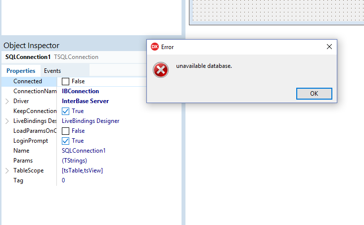

`I come here not to bury Delphi, but to praise it.`
====


But first what is Delphi?
---------------

>It is a riddle, wrapped in a mystery, inside an enigma


It's not a controversial statement that Delphi is not what it once was.  
Now it supports 64 bit projects across the 3 main desktop platforms, to pick one evolution of the product.  
Yet, the key aspects are still there, if not event better than before.


There many things I will not be discussing in this article. 
For example, there is always _Much To Discuss_ when it comes to choice of programming language, I am told, but I will be steering well clear of that quagmire.  
Comparing laundry lists of features between languages in some kind of checklist knockout tournament is not the aim here: 
Instead, I want to recall - or perhaps eulogise - a general seam of features of the tool that - for me - made Delphi the game changer that it was..  
Back when I used it full time these were what made it so productive and fun to work with, and I humbly submit that there are few tools that come close to touching it even now.

First, A Quick Review
----------------

Delphi is a commercial product for developing software - [embarcadero2019-1], [wikipedia2019-1], with a proprietary IDE and version of Object Pascal [wikipedia2019-2] that integrates tightly with the solution [embarcaderodocs2019-1] . There is even a free version you can download from [embarcadero2019-2], and if you can puzzle your way past the registration djinns, you can have it up and running in very little time.
It mainly produces native binaries, originally targetting Windows 16 bit, now 32-bit and 64-bit.

A heavily abridged table of releases with release for some key milestones

 Year | Release | Supports | Significant changes
|--- |--- |---  |---  
| 1993 | Delphi 1.0 | Win16 | From out of nowhere, handling a GPF
| 1996 | Borland Delphi 2 | Win32 | first win32 compiler
| 1998 | Inprise Delphi 4 | Win32 | last version allowing 16-bit development
| 2003 | Borland Delphi 8 | Win32 | .NET
| 2005 | Borland Delphi 2005 | Win32 |
| 2011 | Embarcadero Delphi XE2 | Win32, Win64 | first version producing 64-bit binaries
| 2012 | Embarcadero Delphi XE3 | Win32, Win64 | last version with .NET support
| 2018 | Embarcadero Delphi 10.3 Rio | Win32, Win64 | current day

There is even an ACCU article  [accu1998] article, and if you want a much funnier, arguably less overtly technical summary of the early days - try this on for size [stob2002].

Five bullet points to give a flavour of the system:

### Fast

Compile times were always in the vanguard, and the time to a fully linked executable that was ready to go was also very short. In the days of "spinning rust" drives, this really mattered.

### Strongly Typed (mainly*)

For loops could only be integers. I got over it very quickly and never looked back, to be honest.  
You could (and should) declare enums and sub-ranges and it would be a compilition and runtime error to assign incorrect values.

```delphi
// everyone likes cards
type
  Suit = (Club, Diamond, Heart, Spade);
// small things that it's just embarassing to get wrong
  SmallNumber = -128..127;
  SomeCaps = 'A'..'Z';
  Month = 0..11;
```

### Run Time Type information at all times

If your variables are all strongly typed, this enables introspection without needing to resort to home-brew persistence / reflection methods. 

### Straightforward dependency management
  
The language has files called `units` - basically modules, which supported `interface` and `implementation` sections for exported symbols and internal only code. Circular dependencies were a _compile time error_, this strongly encouraged a way of organising one's code in such a way that one only had to really inspect the implementation section of a unit, and then choose whether to make it a dependency in the interface or not. Rinse and repeat for the rest of the program.

### Extensible RTL and Viual class libraries with designs showing off strengths of the language features

Object pascal supports class properties (write, read, read/write) as a first class feature.
Objects on the stack are simply not allowed - I suspect eliminating this capability frees Delphi from having to deal with a large class of issues.
Coupled with the ability to use the RTTI, these work together to support configurability of classes from properties.

* although, there were some funky compiler features that allowed for late-bound function calls, mainly to support scripting OLE objects.


### Source based Component Model

This was the time of the rise of the Component based model - people could pay (remember paying for software?) a nugatory amount for a component that would emulate Excel and embed it into their software.

https://en.wikipedia.org/wiki/Component-based_software_engineering


Delphi was inherently very dynamic for its time
---------------------------


This is my central thesis:

In 1999, I could fire up the IDE, load a form connected to, say a database and see and navigate records fetched from the database live in the designer.
The development environment was quick and effective to work in, and I had access to the source for debugging and simply reading the code.  
That feature just on its own, helped to teach me a lot about the engineering of a coherent architecture.
And for those prepared to take the time to investigate, it had a cornucopia of treasures to uncover beyond the super user friendly surface.


### Example: how the ability to read and _debug into_ the source make a difference

Here's a simple UI app I created in a few clicks with no code. Setting one breakpoint and stepping in using one key combination I see where the application launches the main UI form and then enters the main Windows interactive message loop.


_Sidebar_ 
> - " remember the 90s were wild, man"

This was the time of the rise of the Component based model - people could pay (remember paying for software?) a nugatory amount for a component that would emulate, say some portion of the Excel spreadsheet editor and embed it into their software [wikipedia2019-3].  
In Delphi I could study the built-in in components, or follow the tutorials and write my own, if needs be, or figure out how to achieve my aims using the existing functionality.


 TODO(PMM) explain what is meant


Code Example
-----------


### Streaming system - DFM

Now the real killer app for the scope management was the _fully synchronised visual designer_

Let's have a look at some actual code to plug together some hypothetical framework objects.
Note, this process relies upon the concepts of
* properties
* the Delphi closure type
* and RTTI to allow the RTL to work all the magic of wiring up the properties
* there is also a hint of a framework which defines the ownership from the line 
   ```delphi
   TfrmClock.Create(Application);
   ```

```pascal
begin

  frmClock := TfrmClock.Create(Application);
  lblTime := TLabel.Create(frmClock)
  lblTime.Caption := '...'
  trmTick := TTimer.Create(frmClock);
  trmTick.onTimer = trmTickTimer;
  frmClock.AddChild(tmrTick);
  // ...
  
end;  
```

And let's have a look at some hypothetical DSL code to describe the moral equivalent of that code


```dfm
object frmClock: TfrmClock
  Caption = 'Clock'
  object lblTime: TLabel
    Caption = '...'
  end
  object trmTick: TTimer
    OnTimer = trmTickTimer
  end
end
```    

Full disclosure: of course it's actual real DSL (edited slightly for space)

* AND THE IDE WOULD GENERATE ALL OF THAT FOR YOU * 


now with the mere addition of 

```delphi
   lblTime.Caption := TimeToStr(Now);
```
we have a clock app


_So, that's assembling visual components visually sorted then_

#### auto-registry, singletons done right (TM)


```pascal
  
program registration;

{$APPTYPE CONSOLE}

uses
  SysUtils,
  AnotherProcessor in 'depends\AnotherProcessor.pas',
  SomeProcessor in 'depends\SomeProcessor.pas',
  SomeRegistry in 'depends\SomeRegistry.pas';

begin

  try
    WriteLn('Program starting');
    WriteLn(PChar('Registration complete'));
  except
    on E:Exception do
      Writeln(E.Classname, ': ', E.Message);
  end;

  Writeln('Program exiting');

end.

```

```pascal

  unit SomeRegistry;

interface

type
TSomeRegistry = class
public
  procedure RegisterClass(AClass: TClass);
  procedure DeregisterClass(AClass: TClass);

end;


function GetSomeRegistry: TSomeRegistry;

implementation

uses Windows;

var
  mSomeRegistry : TSomeRegistry = nil;


function GetSomeRegistry: TSomeRegistry;
begin
  Result := mSomeRegistry;
end;

{ TSomeRegistry }

procedure TSomeRegistry.RegisterClass(AClass: TClass);
begin
  WriteLn(PChar('Registry Adding: ' + AClass.ClassName));
end;

procedure TSomeRegistry.DeregisterClass(AClass: TClass);
begin
  WriteLn(PChar('Registry Removing: ' + AClass.ClassName));
end;

initialization
  mSomeRegistry := TSomeRegistry.Create();

finalization
  mSomeRegistry.Free;

end.
  
```

```pascal

  
   unit SomeProcessor
   
   type TSomeProcessor = class
   ...
   end;
   
   initialization
   GetSomeRegistry.RegisterClass(TSomeProcessor);

```

```pascal

   unit AnotherProcessor
   
   type TAnotherProcessor = class
   ...
   end;
   
   implementation
   
   initialization
   GetSomeRegistry.RegisterClass(TAnotherProcessor);
   
```

output:

```
Registry Adding: TSomeProcessor
Registry Adding: TAnotherProcessor
Program starting
Registration complete
Program exiting
Registry Removing: TAnotherProcessor
Registry Removing: TSomeProcessor
```

  - note the initialisation follows the lexical ordering in the program unit _in this case_ (but see later) 
  - note the de-init occurs perfectly in the inverse order
  - 
  
  - also note that adding in a code level dependency re-jigs the initialisation order correctly 
  
Add this uses directive into SomeProcessor, adding a source level dependency to AnotherProcessor from the SomeProcessor _implementation_

```pascal

unit SomeProcessor

uses
  AnotherProcessor,
  SomeRegistry;

```

output:

```
Registry Adding: TAnotherProcessor
Registry Adding: TSomeProcessor
Program starting
Registration complete
Program exiting
Registry Removing: TSomeProcessor
Registry Removing: TAnotherProcessor
```

Note this happens when updating the single unit, not the ```program``` code, which remains blissfully agnostic of the changes. 

Note, this was used a lot in the VCL to ensure adding a module "would Do The Right Thing (TM)"


### There are Corrolaries

 
* "No RAII for you, sir"
 - this may have been noted - properties need to have workable defaults (or default behaviour that makes sense)
 - because once you have committed to a property based system for configuring objects, what constructors will you write? Instead the component is plugged into the framework
* no automatic destruction of class instances
 - destruction is explicit, and - key point - with the Delphi component framework would be handled for you correctly
 - coupled with the streaming system's ability to "automagically" find and instantiate the right classes when streaming in a definition, you spend a lot less time worrying about "ownership" - because [a] it's done for you, and [b] if you wanted to do it yourself, you may well get it wrong or find yourself fighting the existing framework every step of the way
* no objects on the stack, a la c++ 
 - this may feel like an intolerable constraint, but it happens to fits in well with the concept of dynamic extensibility -> 
   * The code to construct an object can be supplied, even updated on the fly
     - essentially, a "plugin" system that is capable of plugging in classes and their type metadata _on the fly_
     - BTW the IDE does this every time you rebuild a component package you are working on
* Exceptions can only throw objects, and also, given the singly rooted hierarchy we can always walk our way to the actual instance type if have imported its interface
   * bingo! - an extensible object designer system can simply rollback the stack from the offending starting point 
   * *And what is more* if the function was a property setter, then the IDE system can simply reject arbitrary failed attempts to set a property _without an injection or prior knowledge of the internals of the components that are interacting_


### Example of design-time and run-time exception handling

So, let's see an example of the exception handling strategy in action.
Here is the behaviour when I attempt an operation in the IDE that cannot be fulfilled:



And how that component raised it in the code. Note that same code is run in the IDE, via the component package which can be plugged in via the IDE's extensibility.


In order to investigate this I only had to add this code and hit "Debug" - hence seeing the code by debugging the application, which will generate the same exception. 

```delphi
procedure TForm1.Button1Click(Sender: TObject);
begin
  SQLConnection1.Open;
end;
```

In the IDE, the property set on the object fails, and the user is notified.  
In the application, the default exception handler installed for the application is invoked, as I elected to not install my own handler, or write an exception handling block.

That's the power of a unified and usable approach to exception handling.


In retrospect
---------------

....


C'mon it can't have been that perfect, can it?
------------------

### It was proprietary
Companies get in trouble; the 64-bit compiler took a long time to appear

### Cost concerns
It could end up looking pricey compared to free tools. Yet beware false economies.

### Quality issues
There were some releases that had surprisingly persistent niggles. This is the kind of thing that worries thoughtful programmers.

### Interfacing with code other systems
This was possible, but did require expertise to produce the translation units that could make use of FFI, else one could hope the feature would be implemented in the next version of Delphi


references

Working Code referred to in the article can be found at https://github.com/patrickmmartin/Brute


[embarcadero2019-1] https://www.embarcadero.com/products/delphi  
[wikipedia2019-1] https://en.wikipedia.org/wiki/Delphi_(IDE)  
[wikipedia2019-2] https://en.wikipedia.org/wiki/Object_Pascal  
[embarcaderodocs2019-1] http://docwiki.embarcadero.com/RADStudio/Tokyo/en/Language_Overview  
[embarcadero2019-2] https://www.embarcadero.com/products/delphi/starter  
[accu1998] https://accu.org/index.php/journals/565  
[stob2002] https://www.theregister.co.uk/2012/01/16/verity_stob_sons_of_khan_2011/  
[wikipedia2019-2] https://en.wikipedia.org/wiki/Component-based_software_engineering  
[farhni2018] https://iam.fahrni.me/2018/08/12/1858/  
[oracleatdelphi2005] https://blog.therealoracleatdelphi.com/2005/02/10-years-of-delphi_8.html  
