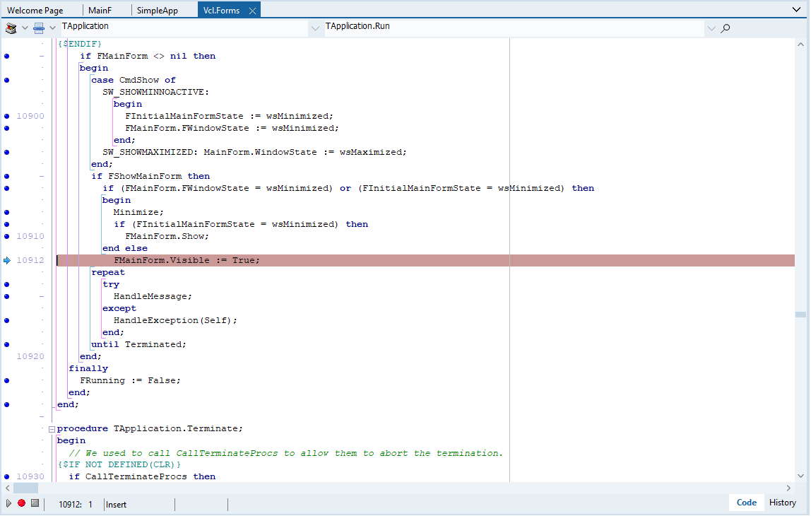
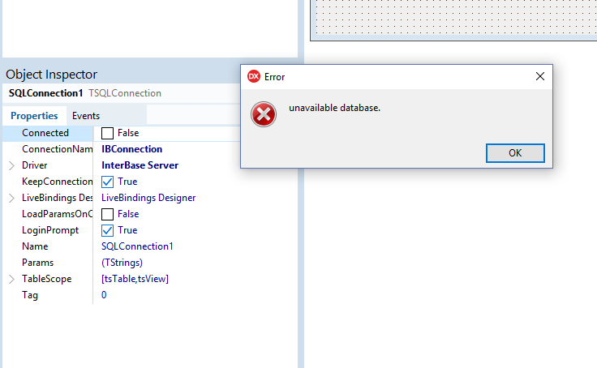
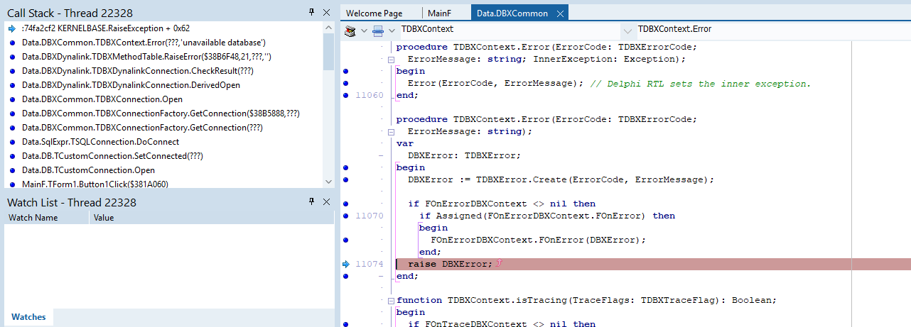
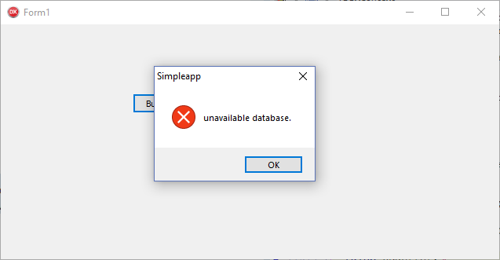

`I come here not to bury Delphi, but to praise it.`
====

But first: what is Delphi
---------------

Perhaps for some of you:
>It is a riddle, wrapped in a mystery, inside an enigma

Google that word nowadays https://www.google.com/search?q=Delphi  

- and I find links to site of the original ancient Greek myths and automative electronic solutions.

 What you need is "Delphi pascal"  https://www.google.com/search?q=Delphi+pascal

 and now we get the actual product homepage [embarcadero2019-1]; The place to go on Wikipedia is [wikipedia2019-1].

 So: it is a commercial product for developing software, with a proprietary IDE and version of Object Pascal [wikipedia2019-2] that integrates tightly with the solution [embarcaderodocs2019-1] . There is even a free version you can download from [embarcadero2019-2], and if you can puzzle your way past the registration djinns, you can have it up and running in very little time.

First, some History
-----

The product has been through a number of owners and a large number of point releases.
Typically there would be a (for once I employ understatement) highly compatible update to the component classes and improvements to the internals and new components and functionality.

| Year | Release | Supports | Significant changes
|--- |--- |---  |---  
| 1993 | Delphi 1.0 | Win16 | From out of nowhere, handling a GPF
| 1996 | Borland Delphi 2 | Win32 |  
| 1997 | Borland Delphi 3 | Win32 |  
| 1998 | Inprise Delphi 4 | Win32 | last version allowing 16-bit development
| 1999 | Borland Delphi 5 | Win32 |  
| 2001 | Borland Delphi 6 | Win32 |  
| 2002 | Borland Delphi 7 | Win32 |  
| 2003 | Borland Delphi 8 | Win32 | .NET
| 2005 | Borland Delphi 2005 | Win32 |
| 2006 | Borland Delphi 2006 | Win32 |
| 2006 | Turbo Delphi and Turbo Delphi for .NET | Windows 32 , .NET
| 2007 | Codegear Delphi 2007  
| 2009 | CodeGear Delphi 2009
| 2010 | Embarcadero Delphi 2010
| 2011 | Embarcadero Delphi XE
| 2011 | Embarcadero Delphi XE2 | Win32, Win64 | first version producing 64-bit binaries
| 2012 | Embarcadero Delphi XE3 | Win32, Win64 | last version with .NET support
| 2013 | Embarcadero Delphi XE4 | Win32, Win64 |  
| 2013 | Embarcadero Delphi XE5 | Win32, Win64 |  
| 2014 | Embarcadero Delphi XE6 | Win32, Win64 |  
| 2014 | Embarcadero Delphi XE7 | Win32, Win64 |  
| 2015 | Embarcadero Delphi XE8 | Win32, Win64 |  
| 2015 | Embarcadero Delphi 10 Seattle | Win32, Win64 |  
| 2017 | Embarcadero Delphi 10.1 Berlin | Win32, Win64 |  
| 2018 | Embarcadero Delphi 10.2 Tokyo | Win32, Win64 |  
| 2018 | Embarcadero Delphi 10.3 Rio | Win32, Win64 |  

The initial release caused quite a stir - fast compiled in a Rapid Application Development model. 

A brief diversion - What's a GPF? - in the days of 16 bit programming under Windows 3.x, these were dreaded error dialogues, usually the harbinger of doom for some poor application.  
Finding any evidence of this era is becoming tricky but there is a picture here [farhni2018] and from [oracleatdelphi2005] we have some reminiscences - and I quote:

>When Anders referenced that nil PChar, there was a literal hush in the room, and when it didn't crash, putting up an exception instead, the place went crazy. 

### Prior Art

Amusingly I found an Overload article from December 1998, which from our look-up table we can see is circa the Delphi 3 era [accu1998].  
Hence almost 20 years ago the feature set was reviewed for that Delphi; version 3 was the second 32-bit release - so no references to GPFs in that article (hooray).  
In my opinion, the feature set reviewed is a good selection. However there are some lacunae which are still relevant today that conveniently overlap with some of my observations to follow.

_Full disclosure_: as with most mature professional products, the full Delphi feature set is quite massive, so one has to make choices as to what to omit - I approciate the other authors had to do this and I will also be selecting highlights.

That said: of the features reviewed in [accu1998] article, the major changes I would choose to highlight since then would be (in order of awesomeness)
* full 64-bit support is available
* support for multiple platforms (linux, iOS)
* operator overloading has been added to the language, along with quite a few other interesting tweaks, like closures

If you want a much funnier, arguably less overtly technical summary of the early days - try this on for size [stob2002].

OK, what made Delphi so Awesome IYHO - convince me!
---------------------------

Challenge.  
Accepted.  

> Delphi was just inherently the most dynamic system _by design_ for its time.

This is my central thesis:

In 1999, I could fire up the IDE, load a form connected to, say a database and see and navigate records fetched from the database live in the designer.
The development environment was quick and effective to work in, and I had access to the source for debugging and simply reading the code.  
That feauture just on its own, helped to teach me a lot about the engineering of a coherent architecture.
And for those prepared to take the time to investigate, it had a cornucopia of treasures to uncover beyond the super user friendly surface.


### Example: how the ability to read and _debug into_ the source make a difference

Here's a simple UI app I created in a few clicks with no code. Setting one breakpoint and stepping in using one key combination I see where the application launches the main UI form and then enters the main Windows interactive message loop.



_Sidebar_ 
> - " remember the 90s were wild, man"

This was the time of the rise of the Component based model - people could pay (remember paying for software?) a nugatory amount for a component that would emulate, say some portion of the Excel spreadsheet editor and embed it into their software [wikipedia2019-3].  
In Delphi I could study the built-in in components, or follow the tutorials and write my own, if needs be, or figure out how to achieve my aims using the existing functionality.

### Let's review the basics

### Basic usability
* out of the box toolchain -> if you think that's not a problem worth solving - take a look around your company and how many home-brew build systems there are
* blindingly fast code compilation -> 100K lines per second and as there are no templates, that line count comes directly from the files
* linking so fast some people did not believe (true story) the system produced linked binaries - this was in 1999 -> imagine that on a SSD nowadays

### The Language
* Delphi strongly encouraged code modules
* single inheritance chain for base classes - TODO(PMM) corollaries
* properties as a first class language feature 
* fully integrated exception handling solution - classes only and the component library had a standard approach to reporting error conditions  which was leveraged strongly - we'll come to that. We'll also come back to this w.r.t. the advantages in debugging of the singly rooted class hierarchy
* full access to the source TODO you could even set up the debugger to step through the Delphi runtime code if you were curious enough

### The Environment
* a carefully through out streaming system, allowing objects to be defined with a textual format
* a decent set of visual classes in V1.0 (1993 remember) growing to a massive palette in later versions
* fully integrated IDE with designers for visual classes and most of the additional object types 
* live preview of classes
* all of the above with *full extensibility* by your code or even 3rd party code


### Source based Component Model

 TODO(PMM) explain what is meant


 The language - a brief tour
----

Key things:

- concept of _interface_ and _implementation_  of modules

- RTTI that *worked*

- the language, well you either love it or you don't  
*then*
```pascal
procedure Proc
var
   i : Integer;
begin
   // we can have comments
   (*
    in both styles
   *)
end;
```

- blindingly fast compilation
  You'll have to just take my word for it

- a really good string type right out of the box: "c and c++ - don't think I can't see you in the corner - don't even start, ok?"
 language supports concatentation, reference counted, string length stored as part of the string, fully compatible with C char arrays 
  - note the modernised version of Delphi cunningly stores the encoding 

- integer types and subrange stypes
  
- proper enforced enumerations ( compile time and even runtime for your sneaky sneaky type casters)

- almost perfect dependency management for units (IMHO)
  TODO(PMM) research
- incremental, smart linker
  TODO(PMM) research
- simple type system (well until generics, anyway)
  TODO(PMM) research
 - records (heap, stack)
```pascal
type TRecord = record
// fields
end;
```
 - classes (heap *only*)
```pascal
type TSomeClass = class(TSomeBase, ISomeInterface)
// fields, methods, properties
end;
```
  - classes had langauge support for inheritance
 - well and also objects, so weird class / record hybrid everyone forgot about
```pascal
type TSomeClass = object
// fields, methods NO constructor / destructor
end;
```

- PROPERTIES

```pascal
  property SomeProp read FSomeProp write SetSomeProp;
```

- READ ONLY PROPERTIES

```pascal
  property SomeProp read FSomeProp;
```

- PROPERTIES
 - indexed properties

```pascal
  property SomeProp index TODO(PMM) read FSomeProp write SetSomeProp;
```

- pointer to class method types
  - pain-free syntax for class callbacks 
  - also, entirely trivial to stitch together methods to attach behaviour to compose classes
  - this was used (and sometimes abused) for UI development
  
  
```pascal
  type TCallBack = procedure (i : Integer) of object;
  
  recipient.Callback = handler.CallbackProc;
  
  // or even more abstracted....
  
  recipient.Callback = handlerRegistry.Lookup(key);
  
  
```


Code Example
-----------


### Streaming system - DFM

Now the real killer app for the scope management was the _fully synchronised visual designer_

Let's have a look at some actual code to plug together some hypothetical framework objects
TODO

```pascal
var
  frmServers: TfrmServers;
//  time passes ...
begin

  frmServers := TfrmServers.Create(Application);
  tmrLocate := TTimer.Create;
  tmrLocate.onTimer = tmrLocateTimer;
  frmServers.AddChild(trmLocate);
  
end;  
```

And let's have a look at some hypothetical DSL code to describe the moral equivalent of that code
TODO


```dfm
object frmServers: TfrmServers
// some properties
  object tmrLocate: TTimer
    OnTimer = tmrLocateTimer
```    

Full disclosure: of course it's actual real DSL

* AND THE IDE WOULD GENERATE ALL OF THAT FOR YOU * 


### Class references


``` pascal
type Foo = type Bar;
```


### built-in types, subrange, set, enumerations

TODO(PMM) example

### multtple inheritance

TODO(PMM) example


### modules

TODO(PMM) example

### "push-button" static linking or dynamic linking with one 


### more compile-time gurantees 
- `initialization`
run in the correct dependency order 
- `finalization`
always runs
- `destructor`
when is it run automatically?

#### auto-registry, singletons done right (TM)


```pascal
  
program registration;

{$APPTYPE CONSOLE}

uses
  SysUtils,
  AnotherProcessor in 'depends\AnotherProcessor.pas',
  SomeProcessor in 'depends\SomeProcessor.pas',
  SomeRegistry in 'depends\SomeRegistry.pas';

begin

  try
    WriteLn('Program starting');
    WriteLn(PChar('Registration complete'));
  except
    on E:Exception do
      Writeln(E.Classname, ': ', E.Message);
  end;

  Writeln('Program exiting');

end.

```

```pascal

  unit SomeRegistry;

interface

type
TSomeRegistry = class
public
  procedure RegisterClass(AClass: TClass);
  procedure DeregisterClass(AClass: TClass);

end;


function GetSomeRegistry: TSomeRegistry;

implementation

uses Windows;

var
  mSomeRegistry : TSomeRegistry = nil;


function GetSomeRegistry: TSomeRegistry;
begin
  Result := mSomeRegistry;
end;

{ TSomeRegistry }

procedure TSomeRegistry.RegisterClass(AClass: TClass);
begin
  WriteLn(PChar('Registry Adding: ' + AClass.ClassName));
end;

procedure TSomeRegistry.DeregisterClass(AClass: TClass);
begin
  WriteLn(PChar('Registry Removing: ' + AClass.ClassName));
end;

initialization
  mSomeRegistry := TSomeRegistry.Create();

finalization
  mSomeRegistry.Free;

end.
  
```

```pascal

  
   unit SomeProcessor
   
   type TSomeProcessor = class
   ...
   end;
   
   initialization
   GetSomeRegistry.RegisterClass(TSomeProcessor);

```

```pascal

   unit AnotherProcessor
   
   type TAnotherProcessor = class
   ...
   end;
   
   implementation
   
   initialization
   GetSomeRegistry.RegisterClass(TAnotherProcessor);
   
```

output:

```
Registry Adding: TSomeProcessor
Registry Adding: TAnotherProcessor
Program starting
Registration complete
Program exiting
Registry Removing: TAnotherProcessor
Registry Removing: TSomeProcessor
```

  - note the initialisation follows the lexical ordering in the program unit _in this case_ (but see later) 
  - note the de-init occurs perfectly in the inverse order
  - 
  
  - also note that adding in a code level dependency re-jigs the initialisation order correctly 
  
Add this uses directive into SomeProcessor, adding a source level dependency to AnotherProcessor from the SomeProcessor _implementation_

```pascal

unit SomeProcessor

uses
  AnotherProcessor,
  SomeRegistry;

```

output:

```
Registry Adding: TAnotherProcessor
Registry Adding: TSomeProcessor
Program starting
Registration complete
Program exiting
Registry Removing: TSomeProcessor
Registry Removing: TAnotherProcessor
```

Note this happens when updating the single unit, not the ```program``` code, which remains blissfully agnostic of the changes. 

TODO(PMM) - was used a lot in the VCL to ensure adding a module "would Do The Right Thing (TM)"

see the description in

http://docwiki.embarcadero.com/RADStudio/Rio/en/Programs_and_Units_(Delphi)

### interfaces are the only multiple inheritance route (i.e. Java, there isn't one)

TODO(PMM) example

### pretty decent set of application classes

TODO(PMM) example

### pretty decent set of windowing clases
- handled ownership and parenting and all that good stuff in a manageable manner

### strong component design methodology and support
- interesting, component model from the days of yore, which was part of the then thriving component market 


### There are Corrolaries

> This ain't yer grand-daddy's Pascal

TODO(PMM) - let's talk about what can be achieved and how it is done, and contrast with other languages, in contrast to listing required features (TM)
 
* "No RAII for you, sir"
 - because once you have committed to a property based system for configuring objects, there is no constructor you can write that will handle all future use cases (well, not one you want to have to defend)
* no automatic destruction of class instances
 - destruction is explicit, and - key point - with the Delphi component framework would be handled for you correctly
 - coupled with the streaming system's ability to "automagically" find and instantiate the right classes when streaming in a definition, you spend a lot less time worrying about "ownership" - because [a] it's done for you, and [b] if you wanted to do it yourself, you may well get it wrong or find yourself fighting the existing framework every step of the way
* no objects on the stack, a la c++ 
 - this may feel like an intolerable constraint, but it happens to fits in well with the concept of dynamic extensibility -> 
   * The code to construct an object can be supplied, even updated on the fly
     - essentially, a "plugin" system that is capable of plugging in classes and their type metadata _on the fly_
     - the IDE does this every time you rebuild a component package you are working on
* Exceptions can only throw objects, and also, given the singly rooted hierarchy we can always walk our way to the actual instance type if have imported its interface
   * bingo! - an extensible object designer system can simply rollback the stack from the offending starting point 
   * *And what is more* if the function was a property setter, then the IDE system can simply reject arbitrary failed attempts to set a property _without an injection or prior knowledge of the internals of the components that are interacting_


### Example of design-time and run-time exception handling

So, here is the behaviour when I attempt an operation in the IDE that cannot be fulfilled:



And how that component raised it in the code



In order to investigate this I only had to add this code and hit "Debug"

```delphi
procedure TForm1.Button1Click(Sender: TObject);
begin
  SQLConnection1.Open;
end;
```

That's the power of a unified and usable approach to exception handling.





C'mon it can't have been that perfect, can it?
------------------

Well ...

* Cost
* Various versions causing licensing complications
* Endless changes in marketing direction
* Windows only 
  - until it wasn't 
  - then it was again
  - now it isn't


`Making modules great again.` 
---

### In retrospect


 * single inheritance has been rehabiliated?
  * look at current languages, even C++ recommendations
 
 * exception handling That Just Worked
  * comment on how effective the exception handling model was due to SI - strong exception safety in the runtime *and* components
  * hence a visual editor running your code live and handling exceptions for invalid states live in the IDE
  * its's unclear whether this was science fiction or alien technology
  
>All objects on the heap
I can already hear the screeches if the "performance flying monkeys", but it turned out I never really felt the pain over many years.
Many complaints. But most issues were bad sql, bad file handling or bad algorithm choice


Object Pascal as implemented by Borland had reference types for objects
This meant unlike old style Pascal struct / objects which had to be `New(obj)` to be in a defined state.

Invoking the constructor explicitly in code RAII OOTB  EVERYWHERE
This is in exchange for giving up scope managed object lifetime
  Except ... "with" 
The natural corrolary is it is now possible for external systems to manage scope
Therefore dependencyinjection blah blah blah all that good stuff


- compilation units: it's just modules all the way down, baby
 - TODO(PMM) research this
 - circular dependencies are a _compiler error_,
  - not a "way of life" as some people seem to treat it
 - NO LIBS
 - although there were "packages"
   - TODO(PMM) HOW COULD I HAVE FORGOTTEN ABOUT PACKAGES 
   - although there were some "horror stories" like key variables in some packages initialised *upon load* by other packages, which foxed the IDE's dependency management (which was otherwise pretty cool)
   - THE GREAT DELPHI PACKAGE DRIVE-BY FIASCO
 - proper compiler supported initialisation and finalisation
  - NO STATIC INITIALIZATION FIASCO
   - although see package abuse if you want to learn how to *re-introduce* this
  - unless you want to write your own
- dynamic packages - again something c/ c++ are still yearning for
- An IDE "that was really good, once"
- well thought through streaming system 
 - feeding into a well through through form design system
-  truly amazing commitment to compatibility (for this day and age) demo apps from VCL version 1(?) _would load and run upon pressing F9 in VCL version 17_
- no RAII :P
- easy FFI interface for "C", COM, c++ with some effort
- language supported reference counted interfaces - so RAII if you want it :)
- IDispatch support (freaky, but whatever floats your boat)
- entire application could be statically linked (with very minimal dependencies) or not, at the "press of a button"
- Exception handling that "just worked"
  - related to the singly rooted object hierarchy
   - no `throw 99` - you know who you are!
 - _finally_ blocks - sometimes cleanup is needed
 - there were some very successful templates which were exploited to produce solutions 


_Invented in 1994_

Full disclosure there are some caveats

* Number 1 A base level object type is used everywhere in constructor arguments and glue code arguments. so raising the very legitimate concerns about whether one should apply the rule of using the most derived possible virtual type in arguments
* Objection number 2 of course let the object hierarchy holy wars begin
  * Callbacks to objects were supported again cplusplus misses this feature and therefore does not have this problem but the considerations of typing arguments equally apply
  * So as the phrase goes and if it doesn't let me invent it here "things were wild in the 90s" which brings me to 
 * objection number 3 the whole thing was stitched together by wiring up Windows DLLs.
  *  for those too little to remember the period of time of the *great DLL hell apocalypse* or in fact current times with our massive problems with malware: in many ways this is now frowned upon. Practically of course the issue that you are forcing unwitting users to become expert in writing these DLLs, what creating a system in which deliberate use and misuse of the underlying framework is permitted.
  * As a sidebar: practically the whole thing worked amazingly well. But. Things could drift into going wrong and then it was very hard to figure out.
 * Objection number 4 _they had to modify the definition of c plus plus and produced their own compiler_
  * Have I mentioned the 90s were wild yet?
* Objection number 5: it's Pascal. Apparently in some disciplines it is acceptable, may profitable to be a zealot around the choice of language. 
* Although, *all the preceding considerations* are language independent concepts


* Can't create abstract classes in c++/
* Agenda - can modules be this good ever again?
* TComponent owner, notify were pretty clever
* Federation of languages comment
* Dangling pointers still possible without a coding style to avoid
* Crashes tend to be more reproducible (why?)


Working Code referred to in the article can be found at https://github.com/patrickmmartin/Brute


[embarcadero2019-1] https://www.embarcadero.com/products/delphi  
[wikipedia2019-1] https://en.wikipedia.org/wiki/Delphi_(IDE)  
[wikipedia2019-2] https://en.wikipedia.org/wiki/Object_Pascal  
[embarcaderodocs2019-1] http://docwiki.embarcadero.com/RADStudio/Tokyo/en/Language_Overview  
[embarcadero2019-2] https://www.embarcadero.com/products/delphi/starter  
[accu1998] https://accu.org/index.php/journals/565  
[stob2002] https://www.theregister.co.uk/2012/01/16/verity_stob_sons_of_khan_2011/  
[wikipedia2019-2] https://en.wikipedia.org/wiki/Component-based_software_engineering  
[farhni2018] https://iam.fahrni.me/2018/08/12/1858/  
[oracleatdelphi2005] https://blog.therealoracleatdelphi.com/2005/02/10-years-of-delphi_8.html  
